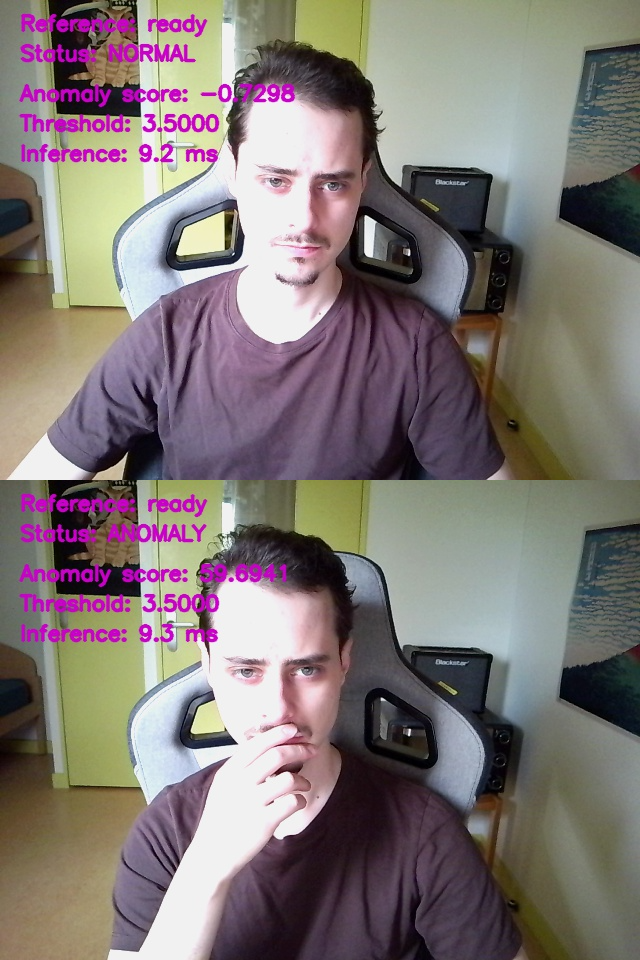
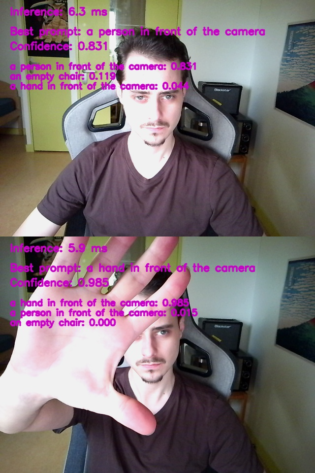
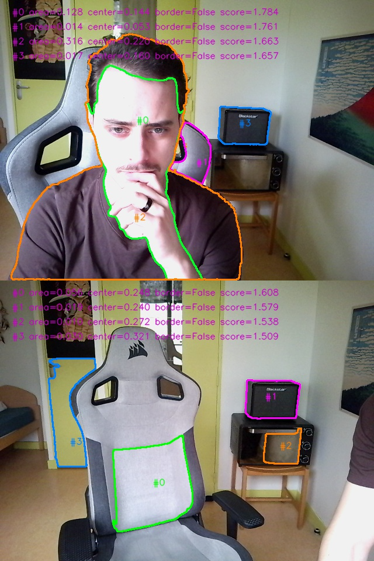

# Webcam Computer Vision Prototype

Real-time computer vision prototype using a webcam to explore:

- Visual anomaly detection (DINOv2)
- Zero-shot image–text similarity (CLIP)
- Image segmentation (SAM)

---

## Overview

The application supports multiple independent and multimodel (pipeline) modes:

## 1. Anomaly Detection (DINOv2)

Learns a “normal” visual state from reference frames and detects deviations.

Pipeline:

```angular2html
Webcam frame
    ↓
DINOv2 embedding (ViT)
    ↓
Reference comparison (cosine distance)
    ↓
Statistical normalization (z-score using mean/std of normal data)
    ↓
Temporal smoothing (EMA)
    ↓
Anomaly score
```

### Example output



## 2. Semantic Labeling (CLIP)

Scores how well the current frame matches predefined text prompts (text-image similarity).

Example prompts:

- a hand in front of the camera
- a person in front of the camera
- a chair
- a mirror

Output:
- Best matching prompt
- Confidence score
- Top-k ranked prompts

Note: prompts can be edited, added or removed manually in `webcam_cv/config.py` under `clip_prompts`

### Example output



## 3. Image Segmentation Mode (SAM)

Select top-k regions from a frozen image.

### Heuristics
The current SAM integration uses lightweight heuristics to improve mask selection, including:

- area-based filtering and ranking
- center-priority scoring
- duplicate / contained-mask suppression

### Example output



## 4. Base Pipeline Mode (Anomaly → Semantic Labeling)

Combine `anomaly detection` + `image labeling` to reduce computational cost:

- Capture, compute and label a normal scene
- Use DINOv2 to detect anomalies
- Use CLIP's text-image similarity only when an anomaly is detected

```angular2html
Webcam frame
    ↓
DINOv2 embedding (ViT)
    ↓
Reference comparison (cosine distance)
    ↓
Temporal smoothing (EMA)
    ↓
Anomaly score
    ↓
[if anomaly detected]
    ↓
CLIP (image–text similarity)
    ↓
Semantic label + confidence
```

## 5. Segmented Pipeline Mode (Anomaly → Localization → Semantic Labeling)

Combine `anomaly detection` + `segmentation` + `cropped labeling` to localize and describe the anomalous region:

- Capture, compute and label a normal scene
- Use DINOv2 to detect anomalies
- Use SAM to generate and rank candidate regions only when an anomaly is detected
- Use CLIP on the best candidate regions to assign a semantic label

```angular2html
Webcam frame
    ↓
DINOv2 embedding (ViT)
    ↓
Reference comparison (cosine distance)
    ↓
Temporal smoothing (EMA)
    ↓
Anomaly score
    ↓
[if anomaly detected]
    ↓
SAM (automatic mask generation)
    ↓
Heuristic mask filtering / ranking
    ↓
Top-k candidate regions
    ↓
CLIP on cropped candidate regions
    ↓
Best region + semantic label + confidence
```

### Example output


---

## Features

- Real-time video processing from webcam streams (OpenCV)
- Anomaly detection using Vision Transformer embeddings (DINOv2)
- Zero-shot semantic labeling via multimodal models (CLIP)
- Automatic segmentation and region proposal (SAM)
- Multi-stage pipeline: anomaly detection → localization → semantic interpretation
- Lightweight heuristic filtering and ranking of candidate regions
- Configurable pipeline behavior (thresholds, delays, modes)
- GPU-accelerated inference (PyTorch + CUDA)
- Optional recording of annotated inference sessions

---

## Project structure

```angular2html
src/webcam_cv/
├── app.py
├── config.py
├── camera.py
├── display.py
├── image.py
├── recorder.py
├── models/
│   ├── base.py
│   ├── dinov2_embedder.py
│   ├── clip_embedder.py
│   ├── sam_segmenter.py
│   ├── factory.py
│   └── registry.py
├── app_modes/
│   ├── anomaly_app.py
│   ├── labeling_app.py.py
│   ├── segmentation_app.py
│   ├── base_pipeline_app.py
│   ├── segmented_pipeline_app.py
│   └── mode_registry.py
├── pipeline/
│   ├── anomaly_stage
│   ├── labeling_stage
│   ├── segmentation_stage
│   ├── dino/
│   │   └── anomaly_scorer
│   ├── sam/
│   │   ├── crop_utils
│   │   ├── mask_candidate
│   │   ├── mask_ranker
│   │   └── mask_overlay
├── experiments
└── └── resolution_benchmark.py
```

---

## Installation

Recommended (conda):

```bash
conda env create -f environment.yml
conda activate computer-vision
```

Alternative (pip):
```bash
pip install -r requirements.txt
```

The two are intended to provide similar runtime capability, but the conda environment is the reference setup for native 
CV dependencies.

### GPU support (optional)

For GPU acceleration, install PyTorch with CUDA support using the official selector:

https://pytorch.org/get-started/locally/

Select:
- Linux
- pip or conda
- CUDA version compatible with your system

If CUDA is not available, the prototype will run on CPU (slower but functional).

---

## Running
```bash
python main.py
```

---

## Configuration

Edit `config.py`

### Select app mode

```python
model_type = 'anomaly'  # or 'labeling', 'base_pipeline'
model_size = 'base'  # or 'None'
```

---

## Controls

### Anomaly mode | Base Pipeline mode | Segmented Pipeline mode

| Key | Action                  |
|-----|-------------------------|
| r   | record reference frames |
| c   | clear reference         |
| s   | save frame              |
| q   | quit                    |


### Labeling mode

| Key | Action     |
|-----|------------|
| s   | save frame |
| q   | quit       |


### Segmentation mode

| Key | Action                            |
|-----|-----------------------------------|
| f   | freeze frame and run segmentation |
| r   | return to live webcam feed        |
| s   | save frame                        |
| q   | quit                              |

---

## Available Models

| Model  | Variants           | Purpose                     |
|--------|--------------------|-----------------------------|
| dinov2 | small, base, large | visual embeddings / anomaly |
| clip   | base, large        | image–text similarity       |
| sam    | base, large, huge  | image segmentation          |

---

## License

This project is licensed under the terms of the MIT license.